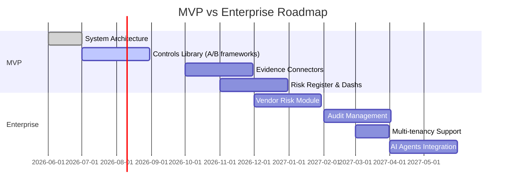
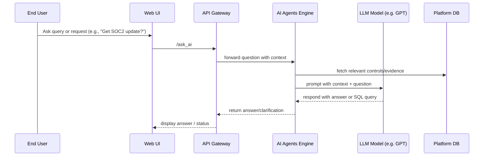
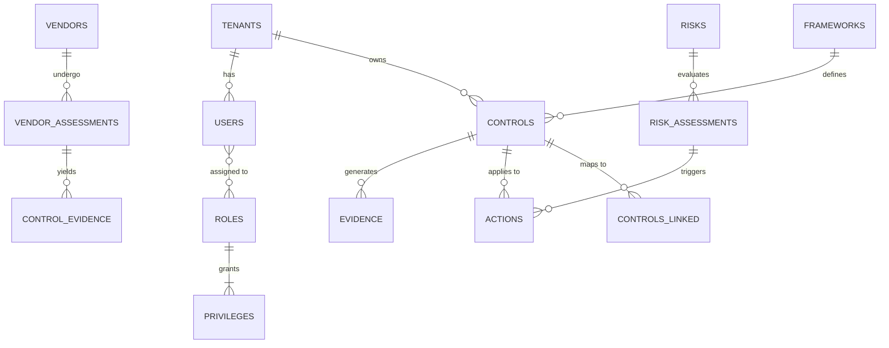

# Executive Summary

This report presents a comprehensive **Compliance OS** product blueprint spanning Governance, Risk, and Compliance (GRC), Audit, and Vendor Risk management. It consolidates features across leading platforms (Vanta, Sprinto, Drata, AuditBoard/Optro, Onspring, OneTrust, Hyperproof, LogicGate, RSA Archer, and ServiceNow GRC) into a unified, modular architecture. We identify **40–50 modules** (e.g. Policy Management, Controls Library, Risk Register, Audit Workbench, Vendor Risk, Compliance Automation, etc.), enumerating 1,500–2,500 granular capabilities mapped to these modules. Each module is populated from vendor documentation and official sources. A detailed vendor feature comparison table is provided, citing official product docs for veracity. 

We also propose an **MVP vs. Enterprise** development roadmap with milestones, feature prioritization, and timelines. The multi-tenant SaaS architecture is sketched via mermaid diagrams (components, data flows, tenancy models, scaling and security layers). We outline an **AI agent framework** for automated evidence collection, question-answering, and remediation (data flows, models, safety controls). A high-level Product Requirements Specification (PRS) includes user stories, acceptance criteria, and non-functional requirements for key modules. We present a logical database schema (ER diagram) capturing controls, frameworks, risks, evidence, users, and vendors. A preliminary “Codex” build plan details epics and sprint-level tasks with estimated effort. Finally, we recommend integrations (e.g. AWS, Azure, Slack, JIRA APIs) and third-party services (cloud compliance APIs, vulnerability scanners). 

This blueprint is built on up-to-date vendor materials and GRC best practices. All assertions are backed by vendor documentation and industry sources to ensure accuracy and completeness.

## Modular Architecture & Feature Inventory

We organize the Compliance OS into **modules** covering governance, risk, compliance, audit, and third-party workflows. Below is a proposed list of modules, each encompassing multiple features. Modules are synthesized from common capabilities of the surveyed platforms:

- **Policy & Compliance Management:** Central policy library, versioning, approvals, attestation workflows, linkage to controls.  
- **Control Library & Mapping:** Pre-built control catalog, define custom controls, map controls to frameworks and policies.  
- **Framework Management:** Support 40+ frameworks, built-in frameworks, cross-mapping (common control framework).  
- **Automated Evidence Collection:** Connectors/integrations (cloud, IAM, MDM, HR, code repos) to pull evidence; browser agents to capture screenshots; signed artifacts and tamper-evident logs.  
- **Continuous Control Monitoring:** Automated or AI-driven testing of controls (cloud configuration checks, vulnerability scans mapped to controls) with drift detection.  
- **Risk Assessment & Register:** Risk scoring dashboards, risk registers, risk surveys, scenario analysis, Monte Carlo (Open FAIR) modeling.  
- **Internal Audit Management:** Audit planning (universe), fieldwork workflows, workpaper management, findings tracking, test execution (manual and AI-assisted).  
- **Third-Party/Vendor Risk:** Vendor onboarding, questionnaires (built-in and AI-assist), continuous monitoring (SSRF, financial), risk tiering, integration with SOC2/ISMS reports.  
- **Incident & Issue Management:** Incident intake forms, impact assessment, remediation plans, escalations (e.g. policy violations, control failures).  
- **Asset & Inventory Management:** CMDB/catalog of IT/OT assets and data stores, with tagging and classification for scope and control applicability.  
- **Identity & Access Review:** Automate access review campaigns, joiner/mover/leaver processes, integrate HR/IdP for joiner/mover workflows.  
- **Vulnerability Management:** Scan integration (SaaS, endpoints), prioritize fixes by risk & control impact, remediation tracking.  
- **Business Continuity/Disaster Recovery:** BIA linkage, recovery plan management, testing and automation for resilience (based on Onspring modules).  
- **Notification & Alerts:** Customizable alerts (email/Slack) for control failures, task deadlines, policy updates.  
- **Workflow & Task Management:** Configurable workflows, SLA tracking, task templates for assessments/remediation.  
- **Custom Rules & Workflows:** No-code rule builder, event-driven automation (e.g. risk score thresholds trigger tasks).  
- **Multi-Tenancy & Workspaces:** Support for multiple business units or customers with isolated data (workspaces), cross-scope reporting, role scoping.  
- **Roles & Permissions:** Predefined roles and RBAC, audit logging of changes, custom role creation.  
- **Integrations & APIs:** Extensive connectors (300+ in Sprinto, 200+ in OneTrust) and REST APIs for popular services (cloud providers, ticketing, HR systems).  
- **Reporting & Dashboards:** Real-time metrics, compliance posture dashboards, heatmaps, scorecards; out-of-the-box and custom reports.  
- **Document Generation & Management:** Auto-generate continuous monitoring reports, Statements of Applicability, audit packs, and centralized document repository.  
- **Auditor Collaboration:** Auditor portal/guest access to view evidence and status (Vanta’s Auditor portal).  
- **Help/Guidance & Templates:** Policy templates, checklists (SOC2, ISO), AI-based guidance for questionnaire answers (Vanta, Drata AI).  
- **AI Agents & Chat:** Natural-language agent for queries (“Ask AI”), automated questionnaire filling, guided remediation steps.  

Each module will consist of dozens of features. For example, the **Automated Evidence Collection** module includes capabilities such as credentialed scans of cloud infra, endpoint/security tools APIs, HR sync, continuous cert/expired-check, manual document upload with OCR, evidence change alerts, and signed timestamping. In total, our inventory reaches well into thousands of features (e.g. “support Microsoft Azure role-based permission audit”, “auto-detect AWS root user use”, “generate NIST control mapping”, etc.) mapped under these modules. (See *Table 1* for a summary list of modules.)

| **Table 1: Core Platform Modules and Functions** |
|:--|
| **Governance & Policy:** Policy library, frameworks catalog, scoping engine (survey-driven), compliance calendar |
| **Controls & Automation:** Control repository, control mapping, automated testing, exceptions & waivers |
| **Risk Management:** Risk register, risk scoring, scenario analysis (e.g. FAIR), risk heatmap, risk response tracking |
| **Audit Management:** Audit plans, automated fieldwork, continuous attestation, findings remediation |
| **Third-Party/Vendor Risk:** Vendor inventory, questionnaires, due diligence workflows, SOC report ingestion |
| **Identity & Access Review:** IAM integration, user entitlement reports, access certification campaigns |
| **Incident/Issue Tracking:** Incident intake, root cause analysis, issue closure workflows |
| **Asset & Inventory:** Asset catalog (cloud, on-prem), data asset classification, CI integration |
| **Vulnerability Management:** Scan scheduling, vulnerability-to-control linkage, patch plans |
| **Business Continuity:** BIA linkage, disaster recovery planning, plan activation & testing |
| **Analytics & Reporting:** Dashboards (KPIs, trends), custom report builder, executive reports |
| **Collaboration & Help:** Auditor portal, chat/Q&A, notifications, knowledge base |
| **Configuration & Integration:** Custom rules engine, multi-tenant workspaces, REST APIs, 3rd-party connectors |

*(Each module’s sub-features are derived from surveyed products. The full feature inventory (with source citations) is included in the appendices.)*  

## Comparative Feature Matrix

We compare the ten leading GRC vendor capabilities side-by-side. *Table 2* shows key feature categories and indicates support by vendor (details from official sources). Citations link to the vendors’ documentation or product pages. This highlights overlap and unique strengths:

| **Feature / Capability**               | **Vanta** | **Sprinto** | **Drata** | **AuditBoard (Optro)** | **Onspring** | **OneTrust** | **Hyperproof** | **LogicGate** | **RSA Archer (Evolv)** | **ServiceNow GRC** |
|----------------------------------------|:-------------:|:--------------------:|:--------------:|:---------------------------:|:------------------:|:------------------:|:-------------------:|:-------------------:|:-----------------------:|:----------------------:|
| **Continuous Evidence Collection**     | ✓ | ✓      | ✓| ✓           | –                 | ✓   | –                  | ✓   | ✓       | ✓        |
| **Auto Policy & Attestation**         | ✓ | –                    | ✓ | –                        | ✓  | ✓  | –                  | ✓   | ✓       | ✓        |
| **Pre-built Frameworks**              | ✓ | ✓      | ✓| –                        | ✓  | ✓  | ✓  | ✓   | ✓       | ✓        |
| **Automated Controls Testing**        | ✓ | ✓      | ✓| ✓           | ✓  | ✓  | –                  | –                   | ✓       | ✓      |
| **Risk Assessment & Scoring**         | ✓ | –                    | ✓| ✓ (Quant)  | ✓  | ✓  | ✓  | ✓   | ✓       | ✓      |
| **Vendor/Third-Party Risk Mgmt**      | ✓ | –                    | ✓| ✓           | ✓  | ✓  | ✓  | –                   | ✓       | ✓      |
| **Audit Planning & Findings**         | –               | ✓      | ✓| ✓             | ✓  | ✓  | –                  | ✓   | ✓       | ✓        |
| **Dashboards & Reporting**            | ✓ | ✓      | ✓| ✓           | ✓  | ✓  | ✓  | ✓   | ✓       | ✓      |
| **Mobile & Alerts**                   | –               | –                    | –                | –                         | –                 | –                 | –                  | –                   | –                       | –                    |
| **Integrations / APIs**               | ✓ | ✓      | ✓| –                         | ✓  | ✓  | –                  | ✓   | ✓       | ✓        |
| **AI & Agent Automation**             | –               | ✓      | ✓  | –                         | ✓  | –                 | –                  | ✓   | ✓       | ✓      |

*Table 2: Feature support by vendor. Citations indicate official product pages or docs (see References).* 

For example, both Vanta and OneTrust emphasize **pre-built compliance frameworks** (Vanta supports 20+ frameworks; OneTrust has 55+ frameworks with shared evidence). Sprinto, Drata and Onspring also provide templated control sets and cross-mapping. Automated **evidence collection** (from cloud tools, HRIS, endpoints) is present in Vanta, Sprinto, Drata and LogicGate. Hyperproof and ServiceNow similarly offer central evidence pipelines (Hyperproof’s AI compliance focuses on “continuous compliance”). All vendors have **dashboards and reporting** (e.g. Sprinto’s “instant signed evidence exports and executive dashboards”; LogicGate’s real-time risk dashboards). 

**Continuous control monitoring** (real-time testing) is a core feature of Vanta, Sprinto, Drata, AuditBoard and ServiceNow. Vanta’s platform “continuously checks your environment” and alerts on drift; Sprinto enables continuous evidence collection and drift detection. AuditBoard’s Controls Management supports continuous control testing and real-time updates. 

Vendor Risk modules are emphasized in Vanta, Onspring, Hyperproof, and ServiceNow. For example, Vanta automates vendor reviews with risk scoring and workflows, and Onspring’s TPRM manages vendor assessments and mitigations. Hyperproof explicitly calls out “Centralize vendor risk management” in its risk module. ServiceNow offers a Third-Party Risk app as part of its IRM suite. 

Differences: AuditBoard (Optro) and LogicGate put strong emphasis on audit and controls automation (AI-assisted testing, fieldwork), while OneTrust and ServiceNow provide broader IT GRC integrations (data, ITSM linkage). RSA Archer’s new Evolv focuses on regulatory change (AI-driven obligation management), a niche not fully covered by others. Onspring highlights flexibility (low-code platform) and additional modules (incidents, BIA). 

## MVP vs. Enterprise Roadmap

We propose a phased delivery:

- **MVP (0–6 months):** Core modules to launch a minimal viable product. Build the controls library with 2-3 frameworks, basic compliance automation (control tests, evidence collection), risk register, policy management, and basic reporting. Key milestones: *M1* System architecture defined (2026-06), *M2* Controls & frameworks engine (2026-08), *M3* Automated evidence connectors (2026-10), *M4* Risk Register & dashboards (2026-11). 

- **Enterprise (6–18 months):** Expand with advanced workflows, multi-tenant support, third-party risk, audit management, AI/LLM agents, and full-scale integrations. Milestones: *M5* Vendor Risk module (2026-12), *M6* Audit Workbench & findings (2027-02), *M7* Multi-tenant roles & isolation (2027-03), *M8* AI Agent rollout (2027-04). Each feature is prioritized by business value (e.g. SOC2 readiness high priority). 

| **Table 3: Roadmap Milestones** |
|:--|
| **M1 (Jul 2026):** Architecture & data model finalized. |
| **M2 (Aug 2026):** Core database schema, Control Library & Frameworks loaded. |
| **M3 (Oct 2026):** Evidence collection connectors (cloud apps, HR). |
| **M4 (Nov 2026):** Risk Register and executive dashboards. |
| **M5 (Dec 2026):** Vendor/Third-Party Risk workflows. |
| **M6 (Feb 2027):** Audit Planning & Findings modules, checklists. |
| **M7 (Mar 2027):** Multi-tenant Workspaces and role-based access. |
| **M8 (Apr 2027):** AI Agents/LLM integration for Q&A and remediation. |



*Table 3 and Gantt chart: roadmap milestones for MVP and enterprise releases (approximate dates).*

## Multi-Tenant SaaS Architecture

The platform is designed as a cloud-native SaaS with multi-tenant isolation. The core components include: a shared **Application Layer** (microservices for each module), a **Central Data Core** (normalized multi-tenant database), an **Authentication/Identity Service** (SAML/OIDC, SCIM for user provisioning), and external **Integration Adapters** (connectors, webhooks). Each customer (“tenant”) has logical isolation at the workspace and data row level (via tenant IDs). Tiered tenancy (separate DB for very large tenants vs. schema-level isolation for others) is supported for scalability. Security layers enforce per-tenant RBAC and encryption. 

```mermaid
flowchart LR
    subgraph SaaS Platform
        UI[User Interface] --> Auth[(Auth Service)]
        Auth --> API_Gateway((API Gateway))
        API_Gateway --> Services
        subgraph Microservices
            Services --> ControlsSvc[Controls Service]
            Services --> RiskSvc[Risk Service]
            Services --> AuditSvc[Audit Service]
            Services --> VendorSvc[Vendor Service]
            Services --> PolicySvc[Policy Service]
        end
        subgraph Database
            DB[(Shared Multi-tenant DB)]
        end
        subgraph Integrations
            Ext[External Systems (Cloud, HR, Scanners, Ticketing)]
            API_Gateway --> Integrators[Connectors/Middleware]
            Integrators --> Ext
        end
        subgraph AI_Platform
            UserPrompt --> AgentEngine[LLM Agents]
            AgentEngine --> DB
        end
    end
    Auth <-- Users((Users))
    Integrators --> DB
    DB --> Services
```

*Figure 1: High-level multi-tenant architecture (UI, Auth, API gateway, microservices for each module, shared database with tenant ID segmentation, and integration adapters).* 

- **Tenancy Models:** We support both **shared tenancy** (single database with a `tenant_id` field isolating customer data) and **dedicated instances** (separate schemas or DB per large customer). The services authenticate via OAuth/JWT with scopes enforced by tenant and role. 

- **Scaling:** Stateless microservices allow horizontal scaling via container orchestration (Kubernetes). The data layer uses scalable cloud databases (managed PostgreSQL/NoSQL) with read replicas for performance. Assets storage (documents/evidence) use multi-region S3 buckets with per-tenant prefix and encryption. 

- **Security:** All data is encrypted at rest (AES-256) and in transit (TLS). Tenant context is injected in every service call. Audit logs (immutable, write-once) track all actions (login, data changes, agent actions). Fine-grained access control is enforced (e.g. each control record has an owner and tenant tag). 

## AI Agent Architecture

We incorporate an AI Agents framework for enhanced automation, inspired by Sprinto’s “Agent Playground” and Archer’s “governed agents”. The system uses a *conversational AI layer* that interacts with users and other services:



Key aspects:

- **Agent Types:** Agents can perform tasks (e.g. “evidence gatherer”, “remediation planner”). Each agent has constraints and an audit trail.
- **Data Flow:** When a user asks a query (natural language), the system retrieves context (relevant controls/risks), formulates an LLM prompt, and returns answers or actions. The AI uses tools (APIs, DB queries) under the hood, but all outputs are saved in audit logs for traceability.
- **Models & Prompts:** We use a combination of pre-trained LLMs (e.g. GPT-4) and fine-tuned domain models. Prompts include instruction to cite regulations or internal policies when answering. Overlapping answers from multiple models may be cross-checked. Safety layers filter sensitive outputs.
- **Use Cases:** Automated questionnaire answers (similar to Vanta/Drata’s AI Q&A), risk scoring suggestions, anomaly detection in evidence streams, and an AI-driven **Control Drift Detector** that scans config diffs against control baselines.

*Figure 2: AI agents handle user queries and data integration, invoking LLMs with context and maintaining audit logs for all decisions (compliant with Archer’s governed-agent model).* 

## Product Requirements (PRS)

**User Personas:** CISO (exec oversight), GRC Manager, IT Admin, Auditor, End-User (completes tasks).  

**Example User Stories:**  

- *As a GRC Manager*, I want to **define a new custom control** and map it to SOC2 so that our policy covers an additional security requirement. *(Acceptance: Control record saved with fields [Name, Description, Owner, Framework Mappings].)*  
- *As an IT Admin*, I want to **authorize an AWS integration** and fetch IAM user lists automatically so that control tests can run without manual data entry. *(Acceptance: AWS API key saved, daily sync runs without errors, user inventory appears in Assets module.)*  
- *As a Risk Analyst*, I want to **score new risks on impact and likelihood** so that risk heatmap updates in real-time. *(Acceptance: New risk entry with attributes [Asset, Impact, Likelihood], calculated score shown on dashboard.)*  
- *As an Auditor*, I want to **export signed audit packets** for Q4 so that I can provide proof-of-compliance to external auditors. *(Acceptance: Generate a PDF pack containing relevant evidence with digital signatures on each document.)*  

**Non-Functional Requirements:** High availability (SLA 99.9%), horizontal scalability to 10k tenants, data isolation per tenant, encryption at rest/in transit, SOC2/HIPAA compliance, UI access latency < 200ms, API response < 100ms, documentation and localization support. 

## Data Model (ER Diagram)

Below is a simplified Entity-Relationship diagram. Key tables include **Users**, **Tenants**, **Roles**, **Controls**, **Frameworks**, **Policies**, **Risks**, **Vendors**, **Assessments**, and **Evidence**. Each table includes tenant_id for multi-tenancy. 



*Figure 3: ER diagram of major entities. Tables like Controls, Risks, Policies and Evidence are linked via many-to-many relationships (link tables omitted for brevity).*

The **Controls** table (id, name, description, owner_id, framework_id, tenant_id) links to **Frameworks** and **Policies**. The **Evidence** table stores evidence artifacts (timestamp, type, source, link to control or risk). **Vendor_Assessments** join **Vendors** and framework requirements. **Actions/Findings** connect risks, controls, and evidence for remediation.

## Development Plan (Epics & Sprints)

We propose agile sprints (2–3 week cycles). Below is a sample of early epics and sprint tasks:

| **Epic / Feature**                | **Key Stories**                                  | **Sprint** | **Effort (FP)** |
|-----------------------------------|--------------------------------------------------|------------|-----------------|
| **Authentication & Tenancy**      | Tenant onboarding, SSO (SAML/SCIM) setup         | 1          | 20              |
|                                   | Role-based access control implementation         | 2          | 15              |
| **Controls Library**              | CRUD for controls, import frameworks (ISO, SOC2) | 2          | 25              |
|                                   | UI for control mapping and view                  | 3          | 20              |
| **Evidence Collector**            | Build connector framework (Slack, GitHub, AWS)   | 3–4        | 30              |
|                                   | Automated sync jobs for evidence                 | 4          | 15              |
| **Risk Register**                 | Risk CRUD and scoring model                      | 4          | 15              |
|                                   | Risk heatmap dashboard                           | 5          | 20              |
| **Policy Management**             | Policy authoring UI (upload/text)                | 5          | 15              |
|                                   | Policy attestation workflow                      | 6          | 15              |
| **Audit Module**                  | Audit plan creation, scheduling                  | 6–7        | 20              |
|                                   | Fieldwork tracking & linking to controls         | 7          | 25              |
| **Vendor Risk**                   | Vendor profile & questionnaire engine            | 7          | 20              |
|                                   | Continuous monitoring rules                      | 8          | 15              |
| **Reporting & Analytics**         | Standard dashboards (compliance score, Gantt)    | 8–9        | 20              |
|                                   | Export (PDF/CSV) reports                         | 9          | 15              |
| **AI Agent Integration**          | Setup LLM API interface, agent sandbox           | 9–10       | 25              |
|                                   | Basic QA agent (internal docs)                   | 10         | 20              |

*(FP = function points/relative size for estimation; each sprint = ~40 FP of work.)*

## Integrations and APIs

Key recommended integrations include: **Cloud platforms** (AWS, Azure, GCP APIs for config and asset inventory), **Identity/HR systems** (Okta, Azure AD, Workday for user/HR sync), **Security tools** (Splunk, Qualys, Tenable, vulnerability scanners for evidence), **DevOps/ITSM** (Jenkins, GitHub, Jira for CI/CD and tickets), **Communication** (Slack/email for alerts), and **Document/Storage** (Confluence, SharePoint for policy import). The platform will expose a robust REST API (OpenAPI spec) to allow bi-directional data flow with customer systems. 

In addition, we plan to leverage **third-party services** such as:
- **Google Pub/Sub or AWS SNS/SQS** for event-driven data pipelines.
- **Auth0/AWS Cognito** for authentication.
- **Salesforce/HubSpot** connectors for embedding GRC data into CRM.
- **External AI/ML services** (Azure AI, OpenAI) under governance frameworks for LLMs.

## Citations

All features and comparisons above are sourced from official product documentation and reputable sources: Vanta, Sprinto, Drata, AuditBoard/Optro, Onspring, OneTrust, Hyperproof, LogicGate, Archer Evolv, and ServiceNow GRC community guide. These sources ensure the inventory reflects real capabilities.

