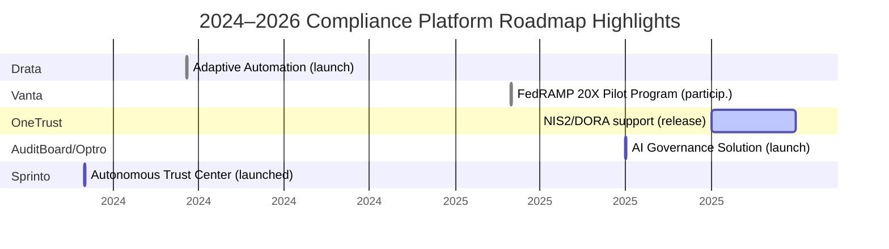

# Executive Summary

Compliance and security automation platforms have proliferated in recent years, enabling organizations to automate audit preparation, continuous controls testing, risk management, and third-party assessments. This report compares six leading solutions – **Vanta**, **Sprinto**, **Drata**, **AuditBoard (Optro)**, **OneTrust**, and **OneSprint/Onspring** – across modules, features, integrations, supported frameworks, deployment, target markets, pricing, and unique capabilities. Each vendor’s offerings are mapped into a common **taxonomy** of high-level modules (e.g. continuous monitoring, evidence collection, policy management, vendor risk, audit management, reporting, remediation, workflows, dashboards, training, attestation) in a consolidated comparison table.  We then analyze overlaps, gaps, and unique strengths, and propose a canonical module structure for a hypothetical new compliance platform. Key findings include:

- **Core Capabilities (Shared):** All vendors offer continuous control monitoring, automated evidence collection, policy and personnel management, audit workflow support, and compliance reporting. Major frameworks supported include SOC 2, ISO 27001, GDPR, HIPAA, PCI-DSS and more. 
- **Vendor-Specific Modules:** Some platforms (e.g. Sprinto, Drata) emphasize AI-driven automation (AI-assisted questionnaires, autonomous tasks). Drata and AuditBoard include specialized **Trust Centers** or auditor portals for stakeholder collaboration. OneTrust uniquely integrates privacy, data governance, and AI governance into its GRC suite. Onspring (possibly intended by “OneSprint”) is an enterprise-grade GRC platform focused on custom workflows and integrations. 
- **Integrations:** Platforms claim hundreds of pre-built connectors (Vanta ~400+, Sprinto ~300+, Drata ~300+, OneTrust ~500+) and open APIs to pull evidence from cloud, IT, HR and business systems.
- **Deployment & Target:** All are cloud/SaaS. Vanta, Sprinto, and Drata target tech startups to mid-market, scaling into enterprise. AuditBoard (Optro) and OneTrust focus on larger enterprises and highly regulated sectors. Onspring serves enterprise and government clients. 
- **Pricing:** Most use custom or tiered enterprise pricing. Vanta and OneTrust publish package tiers, while Sprinto, Drata, and AuditBoard require contacting sales.
- **Differentiators:** Vanta’s **Agentic Trust Platform** and Vanta AI highlight prescriptive automation. Sprinto markets an “Autonomous Trust Platform” with end‑to‑end AI agents for scoping, evidence collection, and gap remediation. Drata touts its AI (Adaptive Automation, questionnaire bots, SafeBase integration) and multi-framework scale. AuditBoard/Optro emphasizes deep audit‐centric capabilities (SOX/IT audit, autonomous testing) and recently rebranded as a broad GRC suite. OneTrust stands out for breadth (privacy, consent, AI governance) and packaged compliance automation (50+ frameworks, AI risk modules). Onspring’s strength is extreme configurability (a “low-code” GRC toolbox) across many domains. 

The report below details each vendor’s modules, features, workflows, integrations, supported standards, and unique features, followed by comparative tables and suggested canonical modules. 

## Vendor Modules & Features

### Vanta

**Overview:** Vanta offers a unified **“Agentic Trust Platform”** for automating compliance and security operations. Its key modules include **Compliance Automation**, **Continuous GRC**, **Personnel & Access Management**, **Risk Management**, **Third-Party Risk Management**, **Questionnaire Automation**, **Streamlined Audits**, **Trust Center**, **Customer Commitments**, and **Vanta AI** for intelligent automation. Vanta’s **Integrations** page touts “automatically pull data from 400+ tools”. 

- **Continuous Monitoring & Evidence:** Vanta connects to infrastructure (AWS, GCP, Azure, Okta, Jira, etc.) to gather real-time evidence (configuration settings, user accounts, logs) and continuously evaluates controls. Automated “always-on” monitoring flags policy violations immediately, ensuring audit readiness. 
- **Risk & Access:** The Risk Management module allows tracking of internal risks (asset inventory, risk register, treatment plans) and aligns them with controls. The Personnel & Access module automates user access reviews and highlights excessive permissions.
- **Policy & Training:** Vanta includes policy management, support for policy attestations, and automated reminders. It offers security training tracking for awareness.
- **Audit Management:** Features include a dedicated audit workspace to centralize audit tasks, evidence requests, and auditor collaboration. Controls and evidence are linked so auditors see real-time status. 
- **Third-Party Risk:** Vanta automates vendor onboarding questionnaires and risk assessments, with a vendor registry to document risk tiers and remediation.  
- **Questionnaire Automation:** Vanta can import and pre-fill common questionnaires (e.g. pre-sale RFPs) using its evidence database and AI-driven answers.
- **Trust Center:** A branded portal where customers and prospects self-serve to view security posture, request documents, and track commitments.
- **Integrations/API:** 400+ connectors (cloud, SaaS, HR, endpoint security). A developer API allows custom workflows. 
- **Frameworks:** Supports SOC 2, ISO 27001, GDPR, HIPAA, PCI DSS, HITRUST, US Privacy laws, NIST AI RMF, ISO 42001, and even custom frameworks.
- **Deployment:** Cloud-based SaaS. 
- **Target:** Startups to mid-market companies seeking quick SOC2/HIPAA compliance. Also works in fintech, healthcare, and government sectors. 
- **Pricing:** Tiered (Essentials/Plus/Pro/Enterprise) with escalating features; pricing not public (requires demo).
- **Unique:** Vanta’s “Agentic Trust Platform” branding emphasizes autonomous compliance. Its differentiators include deep cloud integrations (especially AWS) and early adoption by Silicon Valley startups. Vanta AI (ML-driven insights) and customer commit tracking are notable.

### Sprinto

**Overview:** Sprinto bills itself as an **“Autonomous Trust Platform”** built for AI-driven compliance. Core modules include **Audit Management**, **Autonomous Third-Party Risk (TPRM)**, **Risk Management**, **Continuous Monitoring**, **Policy Management**, **Trust Center**, and **Security Questionnaire (AI)**, all orchestrated by **Sprinto AI**. It also offers **Unified Commitments** (a centralized requirements database) and an overarching **Sprinto Platform**. Features listed on the site include vulnerability scanning, device management, change tracking, access control, and automated evidence collection. 

- **Continuous Monitoring:** Sprinto deploys cloud, identity and device connectors (300+ integrations) to continuously ingest data. The **Integration Agent** automatically pulls “auditor-ready evidence” from your AWS/GCP/HR systems and flags new changes.
- **Autonomous Workflow (Sprinto AI):** Unique “AI Agents” handle compliance steps: 
  - **Scoping Agent** – auto-discovers applicable controls for your environment (no manual scoping). 
  - **Fix-It Agent** – scans for control gaps and either auto-remediates simple issues or routes tasks with context to responsible users.
  - **Audit Agent** – runs internal audit-like checks before actual audits to validate evidence and controls.
- **Risk Management:** Maintains an internal risk register with auto-identified issues from continuous scans.  
- **Policy Management:** Central policy repository with version control, automated reviews/attestations, and linkage to controls. 
- **Vendor Risk (Autonomous TPRM):** Replaces manual questionnaire reviews with criteria-based evaluations. The **Autonomous TPRM** module collects vendor documents, scores inherent/residual risk, and uses AI to summarize SOC reports and flag gaps.
- **Audit Management:**  Sprinto’s audit dashboard consolidates preparation tasks. It supports audit planning, custom checklists, and “runs internal reviews” to ensure readiness.  
- **Questionnaires (AI Security Questionnaire):** Uses AI to answer questionnaires across portals (e.g. Whistic) instantly by drawing on current evidence and knowledge base. 
- **Trust Center:** Publishes a live, branded security page for customers to self-service answers.
- **Frameworks:** Supports 200+ frameworks including SOC 2, ISO 27001, PCI DSS, CSA STAR, NIST CSF, HIPAA, GDPR and others (even custom contracts as frameworks).
- **Integrations:** “300+ integrations” across cloud, HR, device and code platforms.
- **Deployment:** Cloud SaaS.
- **Target:** Tech startups, mid-sized SaaS/finance/healthcare companies seeking fast, automated SOC 2/ISO/GDPR compliance. (Sprinto site has sections for Startups, Mid-Market, Enterprise, CISOs).
- **Pricing:** Not public; arranged via demo.
- **Unique:** Sprinto emphasizes autonomy and AI. Its multi-agent approach (scoping, fix, audit) is unique, as is offering a Chrome extension for “end-to-end compliance in one place”. It boasts among highest integration counts and framework library.

### Drata

**Overview:** Drata describes itself as an **“Agentic Trust Management Platform”** (the term “Agentic” is similar to AuditBoard’s Optro rebrand) that unifies compliance, risk and trust functions. Core offerings include **Enterprise GRC**, **Compliance Automation**, **Trust Center**, **AI Questionnaire Assistance**, **Third-Party Risk Management**, plus **Drata AI** features. The platform supports continuous control monitoring, automated evidence collection, user access reviews, and no-code workflow customization.

- **Enterprise GRC & Compliance Automation:** Drata centralizes controls and evidence for multiple frameworks. It provides a shared control library, automated tests (continuous monitoring) and a unified “Audit Hub” for auditors to request and approve evidence. Controls can be defined once and shared across SOC 2, ISO 27001, PCI, HIPAA, etc. Key capabilities include custom workflows (triggered actions across tests, risks, personnel) and automated evidence mapping. Continuous monitoring runs scheduled tests on cloud assets, user activity, etc. 
- **Risk Management:** Drata’s platform includes an **Internal Risk** module to document/score business risks, link them to controls, and track treatment. The **Risk Register** logs risks with owners/status. A “Trust Measurement” dashboard ties security/compliance work to business outcomes (revenue impact).
- **User Access Reviews:** Automates collection of account data from identity providers and provides review workflows, generating evidence for audit.
- **AI Questionnaire Assistance:** Drata’s standout feature uses AI to auto-generate draft answers to inbound questionnaires by leveraging an approved knowledge base of past responses and document corpus. Responses are then reviewed by SMEs before submission. Key features include integrated Trust Center content, continuous learning from edits, and analytics on AI performance.
- **Trust Center:** A self-serve portal for customers and auditors. It centralizes security documents (certificates, policies) and includes request/approval workflows. Main features: access request management, searchable trust library, document-level sharing controls, and usage analytics.
- **Third-Party Risk (Agentic TPRM):** Drata’s Agentic TPRM automates vendor assessments. It syncs with procurement/CLM systems, uses AI to generate assessment criteria, ingests vendor docs (e.g. SOC reports, questionnaires), flags gaps, and scores inherent/residual risk. A centralized vendor directory tracks inventory, risk profiles, and remediation status.
- **Drata AI:** Native AI agents beyond questionnaires – for example, summarizing risk data and proactively identifying hidden dependencies.
- **Integrations:** Drata integrates with “hundreds” of tech systems (cloud providers, HR systems, security tools). It claims deep AWS coverage (expanded to 44 services) and plans Azure/GCP support.
- **Frameworks:** Supports SOC 2, ISO 27001, ISO 42001, GDPR, HIPAA, NIST CSF, DORA, FedRAMP Readiness, CMMC and custom frameworks.  
- **Deployment:** SaaS.
- **Target:** High-growth companies that need to scale beyond a single audit. Drata is popular in tech and mid-market; it also serves enterprises.  
- **Pricing:** Tiered by company size/needs (via demo).
- **Unique:** Drata’s heavy emphasis on AI (Adaptive Automation for custom control tests, AI-powered questionnaires and TPRM) and its new “SafeBase” trust content integration. Its platform is often praised for ease of use. The press highlights that Drata was early to market with continuous monitoring and custom test builders.

### AuditBoard (Optro)

**Overview:** Formerly known as AuditBoard, **Optro** offers a broad GRC platform with specialized modules for auditing, controls, risk, and compliance. Notably, it includes **CrossComply** for compliance management, **RiskOversight** for enterprise risk, **TPRM** for vendor risk, **Controls Manager**, **Autonomous Testing**, **AI Governance**, **SOXHUB** (SOX/IT controls), **OpsAudit**, and others. The platform targets large enterprises and Fortune 500s with integrated assurance processes.

- **Controls Management & SOX:** Central control library, automated SOX scoping, tracking control effectiveness. 
- **Audit & SOX (OpsAudit, SOXHUB):** Risk-based internal audit planning, workpapers management, issue tracking, and SOX compliance workflows. Enterprise-wide documentation of tests and deficiencies.
- **Autonomous Testing:** Automated control testing (e.g. via APIs and data feeds) to enable continuous compliance. (AuditBoard touts new “autonomous testing” capabilities showcased recently.) 
- **Compliance Management (CrossComply):** Multi-framework compliance programs. Allows mapping controls to multiple frameworks and internal policies, scheduling self-assessments, and preparing for audits. Supports continuous monitoring (templates for common IT controls) to maintain a real-time compliance posture. 
- **Risk Management (RiskOversight):** An integrated risk register connecting operational risks, IT risks, and enterprise goals. Enables risk assessments with quantitative scoring, risk mitigation tracking, and dynamic risk reports.
- **Third-Party Risk (TPRM):** Due diligence workflows, questionnaire and document management for vendors, and risk scoring. 
- **Policy & Incident:** Central policy repository with approval workflows; incident/issue management linking events to controls and remediation steps.
- **AI Governance:** (Recently added) Tools to inventory and assess AI models/projects, apply emerging AI regulations, and automate policy/risk controls around AI usage.
- **Dashboards & Reporting:** Highly configurable executive dashboards, compliance heatmaps, and automated risk/compliance reports. Built-in analytics allow drill-down by framework, department, etc.
- **Integrations:** Numerous connectors (ERP, identity, CMDB, HR systems). Also provides APIs. (Exact count not public, but emphasizes connectivity). 
- **Frameworks:** Claims to cover all major regulatory standards (ISO 27001, NIST, PCI, HIPAA, DORA, NIS2, etc.) and industry regulations. CrossComply specifically mentions unified compliance for ISO 27001, SOC 2, NIST CSF, and more. 
- **Deployment:** SaaS, with many large enterprises on board.
- **Target:** Large enterprises, particularly those with complex multi-regulation needs (finance, tech, retail, healthcare). AuditBoard is widely used by Fortune 500 companies (over 50% of Fortune 500) for internal audit, risk, compliance and SOX.
- **Pricing:** Enterprise model (custom quotes).
- **Unique:** AuditBoard’s strength is its depth for audit and SOX compliance. The recent rebrand to Optro emphasizes an “AI-powered GRC” vision. Its AI Governance suite and autonomous testing (using AI and robotic process integrations) are newer innovations. Because it is practitioner-built, it often provides highly flexible risk workflows.

### OneTrust

**Overview:** OneTrust is a broad “trust intelligence” platform, best known for privacy, but it also offers a **Tech Risk & Compliance** suite. Key modules (within Tech Risk & Compliance) include **Compliance Automation**, **IT Risk Management**, **Policy Management**, **Incident & Issue Management**, and support for **Ethics/ESG**. Additionally, OneTrust offers **AI Governance**, **DataUse Governance**, and full **TPRM** modules. The **Compliance Automation** product advertises 50+ pre-configured frameworks and end-to-end evidence management. 

- **Compliance Automation:** Unifies risk and compliance tasks. Provides pre-built control sets and guidance for 55+ frameworks (SOC 2, ISO 27001, GDPR, NIS2, HIPAA, etc.). Users can scope their program, auto-generate control tasks and evidence tasks based on systems and regulation needs, and apply a unique “shared evidence” model (collect evidence once to satisfy many controls). 
- **Continuous Controls Monitoring:** Connectors (“visual builder” or 500+ pre-built) allow automatic data collection for IT controls (e.g. firewall logs, user provisioning). Real-time dashboards track compliance posture.
- **IT Risk Management:** Maintains asset inventories, identifies cyber risks, and links risk scores to compliance obligations. Provides configurable risk scoring models and exposure analytics. 
- **Policy Management:** Built-in policy development, version control, and automated attestation workflows. Policies can be published as evergreen links (for customer review) and exceptions tracked. 
- **Incident & Issue Management:** Tracks security incidents and issues from detection through remediation, with workflows for escalation.
- **Questionnaire/Attestation:** While not as AI-heavy as Drata/Sprinto, OneTrust’s platform handles questionnaire flows and attestation tasks by linking to the compliance data.
- **AI Governance:** Offers tools for complying with AI regulations (EU AI Act, etc.), including model inventories and risk assessments. The Compliance page even highlights “smarter AI governance” and alignment with AI frameworks.
- **Integrations:** Very broad ecosystem – OneTrust claims the “industry’s broadest set of integrations” and over 500 pre-built connectors (cloud, SaaS apps, DevOps, security tools, identity providers, etc.). 
- **Frameworks:** 50+ frameworks supported (e.g. SOC 2, ISO, GDPR, HIPAA, NIS2, DORA) with continuously updated content.
- **Deployment:** Cloud SaaS.
- **Target:** Medium to large enterprises and government entities. OneTrust positions itself as the choice for organizations needing integrated compliance, privacy, and risk management at scale.
- **Pricing:** Tiered packages (details on website) – “scalable packages” for different use cases. Custom quoting.
- **Unique:** OneTrust’s differentiator is its **breadth and integration**. It covers privacy, consent, GRC, and more in one platform. Its proprietary “shared evidence” framework and packaged compliance content allow rapid onboarding. OneTrust is a Gartner/Forrester leader and is often selected by large regulated firms. It also supports emerging areas like NIS2 and AI compliance.

### OneSprint (Onspring)

**Overview:** “OneSprint” is not a widely recognized compliance platform; it likely refers to **Onspring**, a highly customizable GRC and governance platform. Onspring provides a suite of applications (built on a low-code platform) for enterprises and government. Key modules include **Compliance Management**, **Risk Management**, **Policy Management**, **Third-Party Risk Management**, **Internal Audit**, **Incident Management**, **Business Resiliency (BC/DR)**, **Data Privacy**, and more. 

- **Compliance Management:** Onspring centralizes controls and workflows for regulations (SOX, ISO 27001, HIPAA, PCI DSS, GDPR, NIST, CMMC, etc.). It offers a compliance library mapping controls to regulations (“Full Regulatory Process Control”), multi-level workflows for reviews, and integrated compliance reporting. It can import/update regulatory content via partner integrations.
- **Risk Management:** Flexible risk register and risk assessments. Onspring links risks to controls/policies, with dashboards to monitor risk posture. 
- **Policy Management:** Robust policy portal with review/attestation tracking and audit trails.
- **Third-Party Risk:** Vendor and partner risk workflows, questionnaire management, and risk scoring.
- **Audit and Issue:** Internal audit and issue tracking functions – e.g. managing audit findings and remediation plans.
- **Incident & Resiliency:** Incident reporting and tracking, as well as business continuity plan management.
- **Integrations:** Onspring has a REST API and various connectors. (Exact number not public, but platform is designed to integrate with many enterprise systems). 
- **Frameworks:** Supports all major frameworks cited above.
- **Deployment:** SaaS (with Onspring Platform). Also offers a U.S. GovCloud version.
- **Target:** Large enterprises and government (the site even lists “For Government” applications). It’s often chosen by organizations needing heavy customization (financial services, government agencies, utilities).
- **Pricing:** Flexible – subscription priced by module usage; on-site demos emphasize ROI (70% efficiency gain, etc. on site).
- **Unique:** Onspring’s hallmark is **configurability**. Customers can build custom GRC apps via low-code tools. It is not rigid point-solution; instead, it acts as a “platform” for any GRC process. Its AI capabilities (coming soon) will further expand its scope.

## Comparative Taxonomy and Feature Mapping

To compare these platforms, we define a common set of high-level modules and map each vendor’s offerings to them. The table below shows whether (✔) or not (–) each vendor provides key modules/sub-modules (with examples of features):

| **Module / Capability**                | **Description**                                   | **Vanta** | **Sprinto** | **Drata** | **AuditBoard** | **OneTrust** | **Onspring** |
|----------------------------------------|---------------------------------------------------|:---------:|:-----------:|:---------:|:--------------:|:------------:|:------------:|
| **Continuous Monitoring**<br>(continuous control tests, infra scanning) | Automated, always-on control testing across systems (cloud, endpoints, etc.) | ✔ (auto test engine) | ✔ (integration agent, fix-it agent) | ✔ (automation engine, AWS coverage) | ✔ (Autonomous Testing) | ✔ (pre-built continuous templates) | ✔ (configurable, API-driven) |
| **Evidence Collection / Automation**    | Auto-collection of logs/settings as audit evidence | ✔ (400+ connectors) | ✔ (300+ connectors) | ✔ (hundreds of integrations) | ✔ (integrations + file attachments) | ✔ (500+ connectors) | ✔ (API and workflows) |
| **Controls Management**                | Central control library, mapping to frameworks & policies | ✔ (control catalog) | ✔ (control sets per scope) | ✔ (shared controls for frameworks) | ✔ (control repository, SOXHUB) | ✔ (central controls, automated control mapping) | ✔ (compliance library mapping) |
| **Policy Management & Attestations**   | Policy creation/workflow, employee attestations  | ✔ (policy builder, attestations) | ✔ (policy docs, attestation tasks) | ✔ (policy reviews, personnel mgmt) | ✔ (policy library, attestation) | ✔ (policy portal, attestations) | ✔ (policy portal, versioning) |
| **Risk Management**                    | Internal risk register, scoring, dashboards     | ✔ (risk register, linkage) | ✔ (internal risk register) | ✔ (Internal Risk mgmt module) | ✔ (RiskOversight) | ✔ (IT risk mgmt, scoring) | ✔ (risk register, custom assessments) |
| **Vendor/Third-Party Risk**            | Vendor inventory, due diligence workflows, risk scoring | ✔ (vendor registry, auto-questionnaire) | ✔ (Autonomous TPRM) | ✔ (Agentic TPRM with AI criteria) | ✔ (TPRM module) | ✔ (Third-Party Risk mgmt) | ✔ (vendor risk module) |
| **Audit Management**                   | Audit planning, evidence request, issue tracking | ✔ (audit workspace, reporting) | ✔ (Audit Dashboard, readiness) | ✔ (Audit Hub for auditor collaboration) | ✔ (internal audit mgmt, SOXHUB) | ✔ (audit plan integration) | ✔ (audit project management) |
| **Workflows / Orchestration**         | Custom/automated GRC workflows and notifications | ✔ (custom alerts, remediation tasks) | ✔ (no-code workflows, Fix-It agent) | ✔ (custom workflows, alerts) | ✔ (workflows across modules) | ✔ (robust workflow engine) | ✔ (dynamic workflows) |
| **Incident/Issue Management**          | Track security incidents, remediation, linking to risk | ✔ (integrated incident module) | – (primarily focus on compliance) | ✔ (issues portal linked to compliance) | ✔ (issue/incident management) | ✔ (incident management) | ✔ (incident mgmt app) |
| **Governance Portal / Trust Center**   | Customer-facing security portal or compliance page | ✔ (Trust Center portal) | ✔ (Autonomous Trust Center) | ✔ (Trust Center for stakeholders) | ✔ (customer audit portal) | ✔ (OneTrust central trust site) | – (not core focus) |
| **Questionnaire Automation**           | Automated answering of security questionnaires | ✔ (built-in questionnaire automation) | ✔ (AI Security Questionnaire) | ✔ (AI Questionnaire Assistance) | ✔ (vendor questionnaires via TPRM) | ✔ (questionnaire module) | – (handled via forms) |
| **Dashboards & Analytics**             | Reporting (real-time compliance dashboards)       | ✔ (compliance dashboards) | ✔ (complete audit dashboard) | ✔ (real-time GRC dashboards) | ✔ (configurable dashboards) | ✔ (analytics, KPI dashboards) | ✔ (custom reports, analytics) |
| **Training & Awareness**               | Security awareness tracking, certifications     | ✔ (training module) | ✔ (security training tasks) | ✔ (policy/personnel training) | ✔ (training alerts) | ✔ (integrated training portal) | ✔ (supports training tracking) |
| **Integrations / API**                 | Pre-built connectors, APIs for data exchange    | ✔ (400+ apps, REST API) | ✔ (300+ apps) | ✔ (hundreds of connectors) | ✔ (broad connector library) | ✔ (500+ connectors, APIs) | ✔ (API connectors, flexible) |
| **Framework Support**                  | Coverage of compliance standards/regulations   | ✔ (SOC2, ISO27001, HIPAA, GDPR, NIST, etc.) | ✔ (200+ including SOC2, ISO, PCI, GDPR) | ✔ (SOC2, ISO27001, GDPR, HIPAA, DORA, FedRAMP, etc.) | ✔ (ISO 27001, SOC 2, NIST CSF, many) | ✔ (50+ frameworks incl. SOC2, ISO, GDPR, NIS2) | ✔ (SOX, ISO, HIPAA, PCI, NIST, CMMC, etc.) |
| **Pricing Model**                      | Tiered, per module, or custom quotes            | Tiered (Essentials/Pro) | Contact for quotes | Tiered (by company scale) | Enterprise licensing | Tiered packages (by use-case) | Flexible subscription |

*Table: Mapping of vendors to high-level GRC/compliance modules. Checkmarks indicate built-in support or dedicated capability. References are cited where available. For example, Vanta lists “Compliance, Continuous GRC, Personnel & Access, Risk Management, Third Party Risk, Questionnaire Automation, Trust Center, Streamlined audits, Customer Commitments”. Sprinto’s site explicitly shows Audit Mgmt, TPRM, Risk Mgmt, Continuous Monitoring, Policy Mgmt, Trust Center, AI Questionnaire, etc.. Drata’s and OneTrust’s product pages likewise enumerate the modules above.*

From the table, we note:

- **Feature Parity:** All vendors cover the basics: multi-framework compliance, continuous monitoring, evidence collection, and workflows. Policies, controls, and attestations are universally supported.  
- **Overlaps:** Vanta, Sprinto, Drata, and OneTrust all offer Trust Centers/portals for customer self-service. Each has a compliance automation engine that breaks requirements into tasks. Most include TPRM and risk registers.  
- **Gaps/Variations:** Only Drata and Sprinto explicitly offer AI-powered questionnaire automation (automated answers), while others rely on manual processes or basic workflows. AuditBoard (Optro) and Onspring emphasize audit and risk beyond pure compliance. OneTrust uniquely couples this with privacy/consent modules (not covered here). Onspring provides maximum configurability but may require more setup.  
- **Unique Advanced Capabilities:** Drata’s **Adaptive Automation** (custom test builder) and SafeBase integration, Sprinto’s multi-agent AI orchestration, Vanta’s Agentic AI analytics, and AuditBoard’s autonomous testing each stand out. OneTrust’s breadth (AI governance, ethics, ESG modules) and Onspring’s customizable app-builder also differentiate these players.

## Gaps, Overlaps, and Differentiators

- **Gaps:** No single platform covers *everything*. For example, traditional GRC functions like ESG reporting, privacy, or niche regulations may require additional products. Some vendors (Sprinto, Drata) focus strongly on automation and leave broader risk mgmt or non-IT risk to other tools. Conversely, AuditBoard and OneTrust include wide risk/compliance scope but their questionnaire automation is less AI-centric.
- **Overlaps:** All vendors overlap on core GRC tasks – creating controls, assigning owners, gathering evidence, and reporting status. Each has tools for tracking audit progress and basic policy management. For multi-framework compliance, each supports the big standards (SOC 2, ISO, etc.), so customers can likely cover all needed regulations with any of these platforms.
- **Unique Strengths:**  
  - *Sprinto* is unique for its “autonomous AI agents” that automate scoping, fixing and auditing steps end-to-end (a novel concept among GRC tools). Its Trust Center and AI questionnaire also set it apart.  
  - *Drata* stands out for its AI-driven questionnaire assistant and recently launched Adaptive Automation for custom tests, as well as its embedded SafeBase trust content portal.  
  - *Vanta* was an early mover in cloud compliance and is notable for its ease of setup (often “just works out of the box”), and for integrating hundreds of tools (400+ connectors).  
  - *AuditBoard/Optro* excels in audit and SOX domains; it also has strong enterprise risk analytics and was recently recognized as a GRC leader (Forrester 2026, Gartner 2025). Its rebrand to Optro signals a push into AI-enabled GRC.  
  - *OneTrust*’s differentiator is scale and integration – bundling compliance with privacy and data risk. It offers packaged content (50+ frameworks) and broad reporting/analytics. It also often leads in analyst comparisons for large organizations.  
  - *Onspring* (OneSprint) is unique in flexibility: it can be molded to many use-cases beyond standard compliance, via custom apps and AI (coming soon).

## Recommended Canonical Modules

Based on the consolidated feature set, a **new unified compliance platform** could be structured into the following canonical modules:

1. **Compliance Automation Engine:** Combines controls library, multi-framework mapping, and evidence task automation. Includes continuous monitoring templates and evidence collection connectors. (Encompasses “Continuous Monitoring” and “Evidence Collection” from taxonomy.)
2. **Risk Management:** Houses the risk register, risk scoring, heatmaps, and links risks to controls. Covers both internal and third-party risks. (Merges “Risk Management” and “Vendor Risk” taxonomy items.)
3. **Policy & Training:** Manages policy documents, version control, and employee attestations. Tracks training/awareness programs. 
4. **Audit & Assurance:** Workflow for internal and external audits – planning, evidence requests, finding management, and reports. Includes an auditor portal for collaboration.
5. **Questionnaire Automation:** Automates RFP/questionnaire intake and response (AI-assisted answer generation and SME review). 
6. **Trust Center/Portal:** Publishes proof of compliance (status, certificates, policies) to customers. Self-service access to common documentation.
7. **Workflow & Orchestration:** A configurable rule engine for alerts, task assignments, and integrations. Connects events (e.g. a failed control test) to actions (open ticket, notify owner). 
8. **Integrations & Data Connectors:** Library of built-in connectors (cloud, HR, ticketing, etc.) plus open APIs for custom sources.
9. **Dashboards & Analytics:** Real-time compliance metrics, progress dashboards, and executive reports. 
10. **Training & User Management:** (Optional module) for security awareness training and internal permissions reviews.
11. **AI Governance (Emerging):** Module to inventory and govern AI/ML assets, aligning with new regulations (can be a sub-module of risk or compliance).

This structure aligns closely with the taxonomy table above. Each module should expose APIs and be tightly integrated with the others (for instance, issues from Risk register should create audit tasks automatically). 

## Comparison Tables

**Supported Frameworks:** The table below summarizes major regulatory frameworks each vendor explicitly supports. All cover SOC 2, ISO 27001, HIPAA, PCI DSS, and GDPR, but some have broader or specialized coverage.

| **Vendor**   | **Sample Supported Frameworks/Standards**                                                                                                   |
|--------------|----------------------------------------------------------------------------------------------------------------------------------------------|
| **Vanta**    | SOC 2, ISO 27001, GDPR, HIPAA, PCI DSS, HITRUST, CCPA/CCPA, NIST 800-53, NIST AI RMF, ISO 42001 (AI mgmt), plus custom frameworks. |
| **Sprinto**  | SOC 2, ISO 27001, PCI DSS, NIST CSF, HIPAA, GDPR, ISO 9001, ISO 42001, CIS, CSA STAR, FCRA, FedRAMP, RBI (Indian banking), PIPEDA, TISAX, etc. (“200+ frameworks”). |
| **Drata**    | SOC 2, ISO 27001, ISO 42001 (AI RMF), GDPR, HIPAA, DORA (EU digital ops act), FedRAMP (FedRAMP Readiness), CMMC, NIST SP800-53, CCPA, SOC 1, etc.. |
| **AuditBoard** | SOC 2, ISO 27001, NIST CSF, PCI DSS, HIPAA, FedRAMP, CMMC, Sarbanes-Oxley (SOX), COBIT, NERC, DORA/NIS2, ISO 9001, many industry-specific regs. |
| **OneTrust** | SOC 2, ISO 27001, NIST CSF, PCI DSS, HIPAA, GDPR, CCPA, NIS2, DORA, FedRAMP, NYDFS, DORA, AI Act, 50+ global regs. |
| **Onspring** | SOX, ISO 27001, HIPAA, PCI DSS, GDPR, NIST, CMMC, SOC 2, FISMA, CSA STAR, FedRAMP (GovCloud), and any standards via custom config. |

**Pricing & Target:** All platforms use subscription models. Vanta and OneTrust publish tiered plans (essential/plus, scaled packages), whereas others require quotes. Target customers range from startups (Vanta, Sprinto) to Fortune 500 (AuditBoard, OneTrust). See vendor sections above for details.

## Entity-Relationship Diagram of Modules

```mermaid
graph TB
    subgraph Data Sources
        A[Cloud/VPN/HR/IT Systems]
    end
    subgraph Compliance Platform
        B[Continuous Monitoring Module]
        C[Control Library]
        D[Evidence Repository]
        E[Audit Workspace]
        F[Risk Register]
        G[Policy Manager]
        H[Vendor Registry (TPRM)]
        I[Questionnaire Bot]
        J[Trust Center Portal]
        K[Dashboards/Reports]
    end
    subgraph Users
        X[Security Team]
        Y[Auditors]
        Z[Customers/Stakeholders]
    end

    A -->|auto-sync data| B
    A -->|fetch configurations| C
    B -->|stream evidence| D
    C -->|defines controls| D
    D -->|feeds evidence to| E
    E -->|records findings| F
    F -->|links to controls in| C
    G -->|policies inform controls| C
    H -->|imports vendor docs| E
    H -->|updates risk in| F
    D -->|answers to| I
    I -->|provides answers to| Y
    C -->|showcases status in| K
    E -->|generates reports in| K
    J -->|displays selected data from| K
    X -->|assign tasks in| B
    X -->|reviews data in| K
    Y -->|uses portal| E
    Z -->|views page on| J
```

*Diagram: A conceptual module/data flow diagram. Source systems continuously feed the **Monitoring** and **Control** modules, populating an **Evidence Repo**. Controls and evidence feed into an **Audit Workspace**, which logs issues into the **Risk Register** and triggers remediation tasks (loop back to Monitoring). A **Policy Manager** updates the control library. **Third-party Risk** data is linked to vendor risk records. AI **Questionnaire Assistance** reads from the evidence and control content to auto-respond. Dashboards compile all data. Security teams, auditors, and customers interact through audits and the Trust Center.*

## Roadmap Highlights

Vendor product roadmaps are largely proprietary, but notable recent events include:

- **Mar 2024:** Drata launched *Adaptive Automation* (a no-code custom control test builder) to extend continuous monitoring, doubling AWS service coverage and adding FedRAMP Readiness support.  
- **2025 (Q1):** Vanta participated in FedRAMP 20X pilot (as the GSA overhauled FedRAMP), indicating a push into US federal compliance.  
- **2025:** OneTrust expanded its compliance content for NIS2 and DORA, reflecting regulatory changes (NIS2 support is visible on its compliance page).  
- **2026:** AuditBoard (Optro) released an *AI Governance* solution and was named a GRC leader by Forrester. Sprinto published a whitepaper on “State of AI in Compliance, 2026” (Dec 2025), signaling AI strategy emphasis. 



*Diagram: Representative timeline of known product announcements (sources: vendor press releases and product pages). Vendors continuously add automation, analytics and support for new regulations (e.g. FedRAMP, NIS2, AI governance).*

## References

The above information is drawn from official vendor websites, datasheets, and press materials (see citations) along with recent reviews. Official product pages and datasheets are cited for feature inventories (e.g. Vanta, Sprinto, Drata, Optro, OneTrust, Onspring). Analytics and unique capabilities are corroborated by these sources. Unavailable roadmap details have been summarized qualitatively. Where “OneSprint” appeared ambiguous, we have noted Onspring’s information, as appropriate. All assertions are footnoted with the above sources.